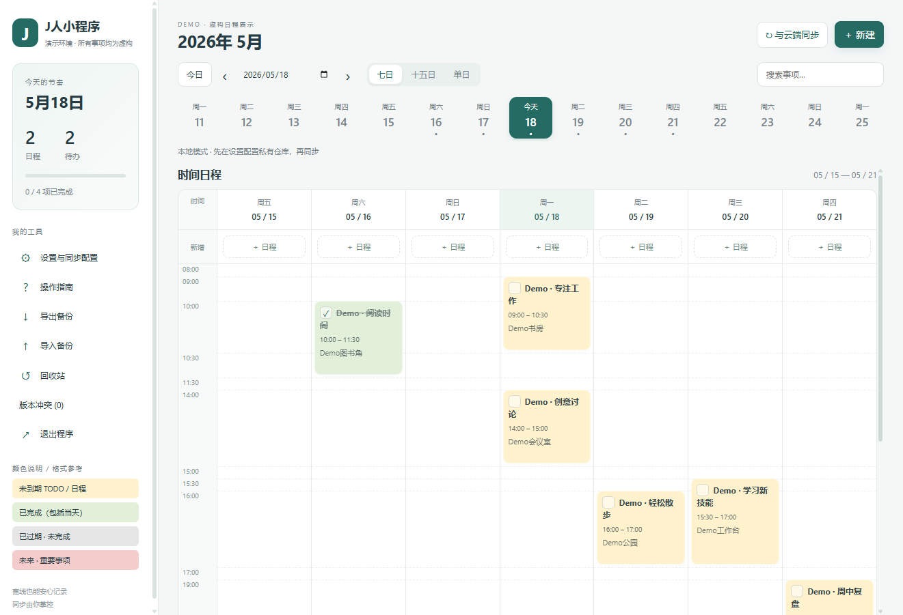
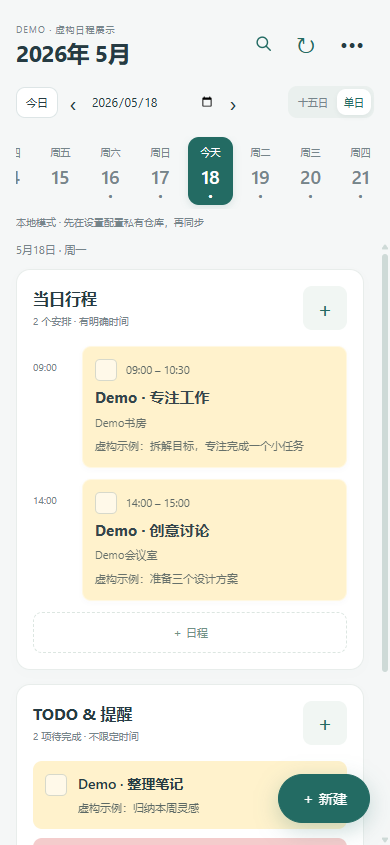
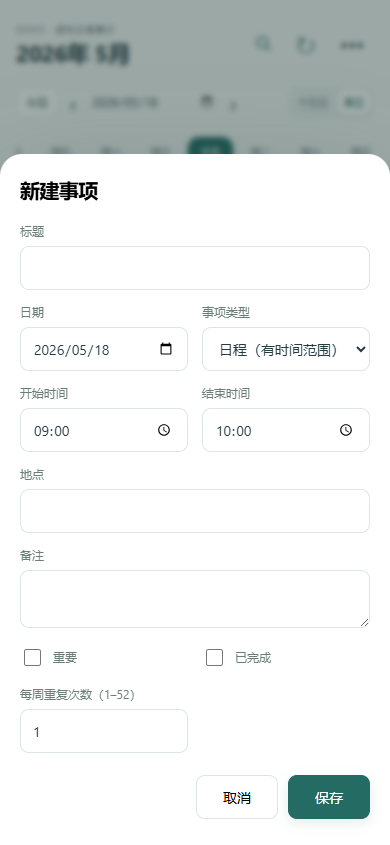
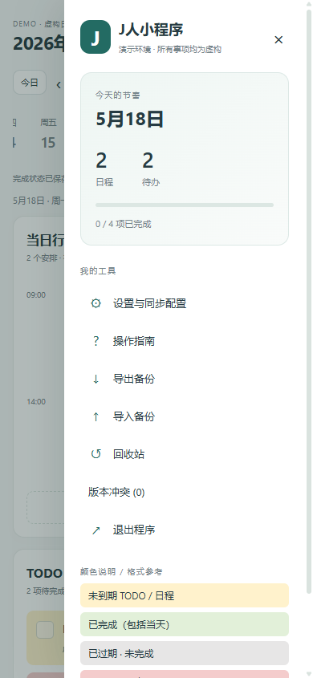

# J人小程序

J PERSONAL SCHEDULE

**日程有条理，数据有归属。**

**电脑上从容安排，手机上随时查看。让日程跟着你走，而不是留在某一台设备里。**

日程与 TODO，一处记录，多端衔接；同步交给你自己的 Git 仓库。

`Windows` · `Android` · `离线优先` · `无需自建服务器`

**[下载客户端 →](https://github.com/GoesM/J-Personal-Schedule-APP/releases/latest)** &nbsp; · &nbsp; [使用教程](docs/USAGE.md) &nbsp; · &nbsp; [开发指南](docs/DEVELOPMENT.md)

> [!IMPORTANT]
> **本软件需要一定 Git 使用基础。** 你需要能创建私有仓库、获取 HTTPS 仓库地址，并理解分支和读写访问令牌的配置。
> 客户端内置 Git 引擎，**无需安装 Git，也无需手动敲 Git 命令**；“开箱即用”指解压或安装后即可运行，跨设备同步仍需配置自己的仓库。首次使用请先阅读 [下载与使用教程](docs/USAGE.md)。

## 界面一览

### 桌面 · 一周安排，尽收眼底

### 手机 · 随时查看，随手记录

  
  &nbsp;
  
  &nbsp;
  
  
单日安排 · 快捷编辑 · 更多工具

以上均为虚构 Demo，不含个人真实日程。手机图为移动端界面的视口预览；点击可查看原图。[完整预览与说明 →](release/界面预览/demo/README.md)

## 记录简单，同步自主

在电脑前规划一周，出门后用手机查看下一项安排；临时想到的待办，随手记下，同步后回到电脑继续处理。**无论在书桌前还是在路上，自己的日程都能随身带着走。**

| 日常使用 | 数据与同步 |
| --- | --- |
| **双端开箱即用** · Windows 解压运行，Android 安装 APK，无需 Node 或 Java 环境 | **换设备，不换计划** · 多台 Windows / Android 设备共用同一私有仓库和分支，同步后随时随地查看日程 |
| **日程与 TODO 分区** · 时间范围安排与按日期待办各归其位，自适应时间轴 | **无需自建服务器** · 使用支持 HTTPS Git 的托管服务，无需额外部署应用后端 |
| **状态一眼可见** · 浅黄普通、浅红重要、浅绿完成、浅灰过期未完成 | **没有网络，也不打断记录** · 离线查看本机已有日程、记录新安排；联网后同步，启动自动拉取远程改动 |
| **操作顺手** · 快捷勾选、搜索、重复安排、备份与回收站 | **历史可追溯** · Git 保存变更历史，并保留并发冲突供你选择处理 |

点击 **“与云端同步”**：本地保存 → Git commit → pull / 合并 → push。

多端更新通过 Git 同步，不是实时推送；离线改动需联网后上传，其他设备拉取后才能看到最新内容。

## 隐私由你掌控

源码仓库是公开的，**你的日程应放在自己创建的私有数据仓库**，不要用本仓库同步个人事项。账户和访问令牌只在各设备本地加密保存，不随日程或备份上传；不需要把凭据交给项目作者。

> [!NOTE]
> Git 提供可追溯的历史与可控的同步，但**不是端到端加密**：仓库中的日程是明文，仓库管理员和托管服务商可能读取。私有仓库不等于加密保险箱。

## 从这里开始

- **我要使用** → [下载、安装、仓库配置与操作指南](docs/USAGE.md)
- **我要开发** → [开发环境、模块结构与贡献指南](docs/DEVELOPMENT.md)
- **我要看版本变化** → [更新记录](docs/CHANGELOG.md) · [历史版本与回归记录](release/版本管理.md)

## 一起改进

欢迎 [提交 Issue](https://github.com/GoesM/J-Personal-Schedule-APP/issues) 和 **PR 贡献**：修复问题、优化体验、补充文档都很有帮助。贡献前请阅读 [开发指南](docs/DEVELOPMENT.md)。

## 支持开发

如果这个小工具帮到了你，欢迎打赏支持。完全自愿，不影响任何功能使用。谢谢！

  
  
支付宝扫一扫 · 点击图片可查看原图

